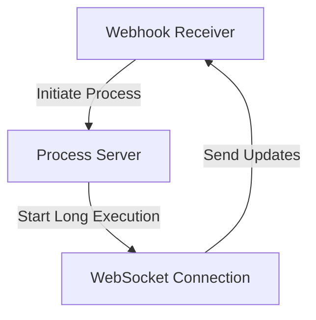
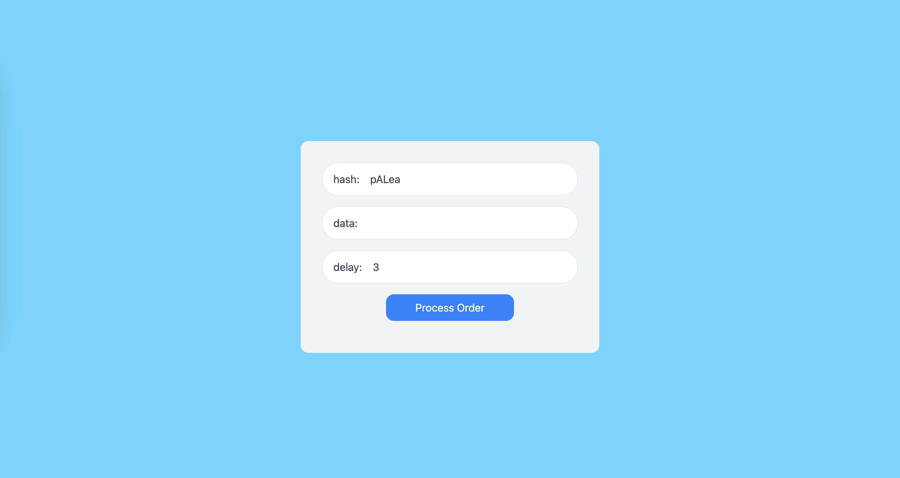

## WebSocket hook with Cloudflare worker + Durable Objects

Inspired by webhook for long execution  process via websocket

Demo
[https://wsshook.ohmdob.workers.dev/home.html](https://wsshook.ohmdob.workers.dev/home.html)

Use case
- Shabu/Buffet Order
- Payment Process

Worker Doc
[https://developers.cloudflare.com/durable-objects/reference/websockets/](https://developers.cloudflare.com/durable-objects/reference/websockets/)